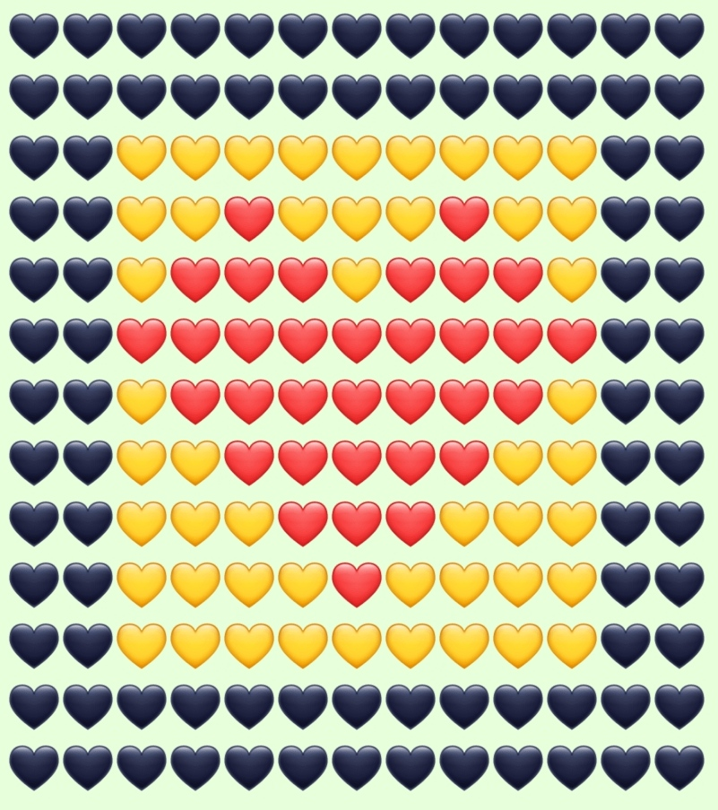

<h4 align="right">
  
</h4>

<h1 align="center">
  Из сердечек
</h1>

---
## Предназначение

---
Данная программа создана для того автоматизировать процесс создания текста такого типа.

## Работа программы

---
После старта, будет задан вопрос, текст делается по заказу или нет. Если текст делается по заказу, то, программа запрашивает имя и ссылку на профиль заказчика, и только потом заказанный текст. Если не по заказу, то, программа сразу запрашивает текст.

## Допустимые значения

---
Программа принимает на вход русские буквы (А - Я). В скором времени будут добавлены еще больше символов.

## Группа в ВК

---
Группа ["Из сердечек"](https://vk.com/izserdechek) в ВКонтакте, где используются данная программа для облегчения работы.